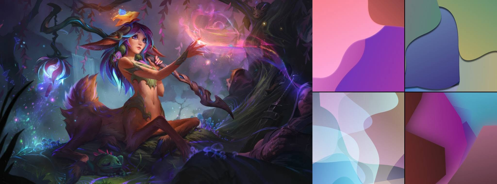
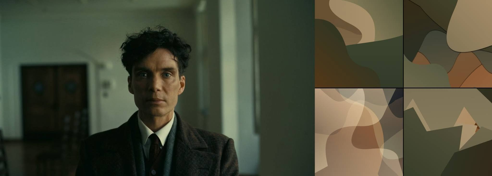
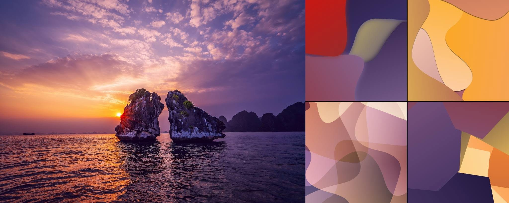

# 🌊 Fluid Mesh Studio HD

> An advanced generative art studio & Color DNA analyzer built with vanilla JavaScript and HTML5 Canvas.


---

## 🔗 Live Demo

Experience the tool directly in your browser:

**[Click here to Launch](https://hieu-bit346.github.io/fluid-mesh-studio/)**

---

## 📖 Overview

**Fluid Mesh Studio HD** extracts key color palettes from uploaded images and generates fluid mesh waves, paper-cut layers, aurora fields, or angular polygon graphics. It features interactive character/item info card creation, real-time hue shifting, radar metrics visualization, and color palette exportation.
This project is built and optimized with the support of the AI agent Gemini (Google).

---

## ✨ Features

* **Advanced Generative Art:** Supports 4 render modes: *Mesh Glow*, *Paper Cut*, *Aurora*, *Polygon* and *Crystal*.
* **Color DNA Analysis:** Evaluates Diversity, Colorfulness, Monochromatic balance, Warmth, and Brightness via an interactive Radar Chart.
* **Manual Crop Tool:** Circular crop modal with live zoom and position tracking.
* **Info Card Studio:** Customizable dual-frame card generator (Avatar & Cover layout) exported directly to high-res PNG.
* **Palette Export:** Export color schemes as standard `.GPL` (GIMP/Photoshop compatible) or copy CSS variable snippets.
* **Animation & Video Export:** Live preview and WebM video recording.
* **Comparison & Composite Board:** Save outputs to compare color metrics and generate grid composite sheets.

---

## 🎨 Showcase & Visual Samples

Here are some demonstration outputs and source samples processed using **Fluid Mesh Studio HD**:

<p align="center">
  
</p>
<p align="center">
  
</p>
<p align="center">
  
</p>

### 📌 Image Credits & Sources
Special thanks to the original creators and photographers for the demo assets used in this project:

1. **Digital Concept Art:** [ArtStation Artwork](https://www.artstation.com/artwork/688AdV)
2. **Cinematic Visual Asset:** [World of Reel Article](https://www.worldofreel.com/blog/2023/10/3/g3phd7qzf6p2tmnd0d8upxyuqhocge)
3. **Landscape Photography (Ha Long Bay):** [Báo Lao Động Media CDN](https://media-cdn-v2.laodong.vn/storage/newsportal/2023/10/12/1253579/Vinh-Ha-Long-1.jpg)

> *Disclaimer: All sample images belong to their respective copyright holders and are used solely for non-commercial demonstration and open-source portfolio showcasing purposes.*

---

## 📁 Project Structure

```text
fluid-mesh-studio/
├── index.html        # Main markup, modals & application state
├── css/
│   └── style.css     # UI styles, theme variables, and layouts
├── js/
│   ├── color.js      # Color algorithms (HSV, K-Means, Diversity, Metrics)
│   ├── renderer.js   # Canvas vector rendering (Waves, Grain, Radar)
│   ├── crop-ui.js    # Interactive circular crop modal logic
│   ├── storage.js    # LocalStorage management & comparison board
│   └── app.js        # Main UI event listeners & state controller
└── README.md         # Project documentation
